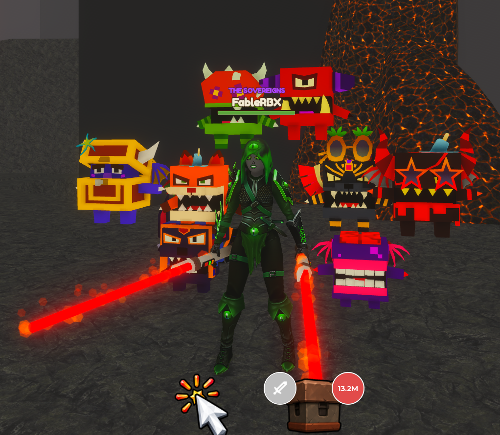

# Push a Giant

Game Design Document

_Core design v1 | 19 September 2026_

A Roblox strength simulator where players do push-ups, grow into giants, and click through dramatic shoving contests to throw increasingly enormous opponents off cliffs. Every victory earns Wins, and the first victory over each giant opens the ramp to a larger arena above.

### The player promise

“That giant looks impossible. I will train, grow, and come back big enough to throw it off the cliff.” The payoff is physical: faster push-ups, stronger-looking arms, a larger avatar, a defeated giant tumbling away, and a new piece of the mountain opening up.

### Core loop

- **Train and grow.** Perform push-ups to build permanent Strength and gradually increase avatar size.
- **Challenge a giant.** Enter a side-view clicking contest; push right while the giant pushes back left.
- **Win and climb.** Throw the giant off the right edge, collect Wins, and unlock the next ramp on the first victory.
- **Upgrade and repeat.** Spend Wins on arm tiers, pet eggs, and occasional aura upgrades to accelerate training. Replay defeated giants when saving for an upgrade.

### Locked system roles

| System            | Purpose                        | Progression rule                                              |
| ----------------- | ------------------------------ | ------------------------------------------------------------- |
| Strength and size | Fight power and visible growth | Strength accumulates through training; size follows Strength. |
| Wins              | The spendable currency         | Earn from successful giant encounters.                        |
| Arms              | More Strength per push-up      | Buy the next material tier directly with Wins.                |
| Pets              | Multiply training gains        | Hatch collectible pets; equip a small team.                   |
| Auras             | Faster push-ups                | Buy a less frequent, fixed ladder with Wins.                  |
| Arena access      | Higher, larger opponents       | First victory permanently opens the next ramp.                |

### Design priorities

Keep one training action, one combat interaction, one Strength stat, and one currency. Make the next goal visible in the world and the next guaranteed purchase clear in the shop. Use exaggerated scale and reactions for spectacle, with short transitions that keep players playing.

The training and material progression build on Lift a Cube; the opposing click meter follows the arm-wrestling-style interaction discussed for this game. Cliff throws, climbing arenas, player growth, and the existing Giant Simulator pet collection establish the new game’s identity.

## The giant encounter

Each giant is a repeatable opponent stationed in the middle of its own arena or on a pedestal. A nearby display shows its name, recommended Strength, and Wins reward. Recommended Strength communicates difficulty; it is not an additional hard entry gate.

| Phase    | Player experience                                            | Required behavior                                                                                                |
| -------- | ------------------------------------------------------------ | ---------------------------------------------------------------------------------------------------------------- |
| Approach | Walk up and trigger Challenge.                               | Use an E proximity prompt on desktop and a touch equivalent. Stop training on entry.                             |
| Ready    | Camera frames the player on the left and giant on the right. | Place both in a pushing pose. Allow a short ready beat before resistance begins.                                 |
| Struggle | Repeated clicks or taps move the meter right.                | Giant resistance continuously moves it left. Strength improves the player’s ability to overcome that resistance. |
| Victory  | The meter reaches the right endpoint.                        | Play the final shove and throw the giant off the right cliff. Award Wins once.                                   |
| Defeat   | The meter reaches the left endpoint.                         | The giant throws the player off the left cliff. Return the player quickly to the current arena’s safe entrance.  |

### Make the struggle physical

The meter, character position, and poses must tell the same story. As the player gains ground, the giant slides toward its edge; losing ground carries the player toward the opposite edge. Leaning, foot scraping, strained expressions, and a near-edge reaction make progress readable before the player looks at the bar.

The final shove should feel much stronger than an ordinary click. Use a clear release pose, an exaggerated fall, and an immediate Wins payout. Keep the fall brief enough that replaying a defeated giant stays satisfying.

### Strength and input

Strength is the preparation advantage; rapid clicking is the encounter action. Near the recommendation, clicking should create a tense, winnable contest. Below it, resistance should feel meaningfully stronger. Far above it, early giants should fall in very few clicks, potentially one, so growth produces an obvious payoff.

Use a normalized progress meter for all giant sizes. The exact starting position, gain per click, resistance curve, input cap, and target encounter length are prototype tuning decisions. Larger arenas must not automatically create longer fights.

### Rewards, failure, and repeat play

- **Every victory pays.** Each successful rematch awards that giant’s Wins payout. Harder giants offer larger rewards.
- **First victory also unlocks.** Remove the barrier to the next ramp for that player and save the unlock permanently.
- **Failure costs the attempt.** Do not remove banked Wins, earned Strength, pets, purchased upgrades, or arena access. Let the player train or retry immediately.

Players must be able to make progress independently. One player’s win must not remove another player’s challenge or open another player’s gate. The technical approach for concurrent challenge scenes remains a prototype decision.

## An ascending world and a growing player

### A staircase of giant arenas

Build a rising sequence of square or rectangular terraces connected by ramps. Each higher terrace holds a larger giant and a larger arena block. The next opponent should be visible above the current one, with a much larger distant opponent providing a longer-term visual goal.

Separate the two spatial directions: combat uses the arena’s left and right cliff edges; progression travels forward and upward along the ramp behind the giant. The ramp barrier falls after the first victory. This keeps the direction of the struggle obvious while giving the world a strong upward journey.

| Area element          | Design rule                                                                                           |
| --------------------- | ----------------------------------------------------------------------------------------------------- |
| Safe arrival space    | Provide room to train, approach the challenge prompt, and recover after defeat.                       |
| Combat platform       | Grow its width and footprint by tier to fit the giant, player, camera, and shove animation.           |
| Exit ramp and barrier | Make the next route visible. First victory opens it permanently for that player.                      |
| Upgrade pedestals     | Place arm and aura offers near the route and training space, where their next prices are easy to see. |
| Pet eggs              | Introduce better eggs at selected higher terraces, typically after a small group of giants.           |

### Bigger spaces without slower play

Keep ramps and useful walking routes short. A huge platform should feel impressive without forcing the player to cross empty ground repeatedly. Put the challenge interaction within convenient reach of the arrival area. Use a few consistent-scale props, such as signs, trees, and railings, so the player can recognize their own growth.

Arena access is saved per player. A cleared giant remains available for farming, and revisiting old terraces is part of the power fantasy. There is no separate Wins toll to reopen a cleared path. Higher shops and eggs follow world access; an extra shop Strength gate is not part of the initial design.

### The player grows with Strength

Increase avatar size gradually as accumulated Strength rises. Use a curve with diminishing size gains: Strength can grow rapidly while physical scale remains manageable. Major growth milestones can get a stronger animation or sound, but size should also advance between milestones.

Size derives from Strength. It has no separate currency or purchase ladder. Spending Wins does not shrink the avatar. Changing pets changes future training gains, not previously earned Strength or size. Cosmetic choices preserve the best purchased arm stat.

New giants should usually remain visibly larger than the player at the point of first challenge. A rough initial art target is 1.5–2.5 times the typical arriving player’s height, with exceptions for dramatic opponents. This is a prototype target, not a fixed ratio across the world.

Scale arm materials with the avatar, and keep camera framing, ramp clearance, signs, and interaction prompts usable at both extremes. Do not enlarge every environmental object in lockstep with the player; that would hide the sense of becoming enormous.

## Push-up training

Push-ups are the sole core training activity. The player starts with the Train button or toolbar slot 1 while standing on valid, safe ground. Training repeats automatically until the player moves, cancels, or begins a giant challenge. It remains available with zero Wins and no pets.

### A simple, satisfying repetition

- **Complete a rep.** Play a readable push-up animation and grant Strength when the repetition completes.
- **Show the gain.** Display a clear +Strength popup and a restrained impact sound. Keep the normal world camera so players can see their growth, pets, and next opponent.
- **Keep the goal visible.** Show current Strength against the next giant’s recommendation and the current training rate.

Normal training does not require constant rapid clicking. The high-effort clicking moment belongs to the giant encounter. Movement should stop push-ups immediately so training never makes the avatar feel trapped.

### An optional active reward: Power Rep

Periodically light up the existing Train button for a Power Rep. Tapping it grants a burst of bonus Strength with an explosive push-up, a larger popup, and a small pet bounce. Missing the opportunity simply lets normal training continue; there is no lost progress or punitive streak reset.

Prototype starting values: offer one opportunity after 8 normal reps and award an additional 3 normal reps’ worth of Strength on a successful tap. These values are tunable. With every opportunity collected and no extra animation delay, this is up to 37.5% more Strength than passive training. The bonus should feel worthwhile while leaving automatic training useful.

### How the three upgrade systems combine

| Variable | Meaning                                    | Controlled by      |
| -------- | ------------------------------------------ | ------------------ |
| A        | Base Strength earned per completed push-up | Equipped arm tier  |
| M        | Combined training multiplier               | Equipped pet team  |
| T        | Seconds per push-up                        | Equipped aura tier |

Strength per push-up = A × M

Baseline Strength per second = (A × M) ÷ T

Example only: arms granting 10 Strength, a 3× pet team multiplier, and a 0.60-second aura produce 30 Strength per rep and 50 Strength per second. This rate excludes Power Rep bonuses and any interruption to training.

### Readability and pacing

Arms make each popup larger. Pets multiply its value. Auras visibly speed up the repetition. Shop previews should show both the direct stat change and its effect on baseline Strength per second so the player can understand a purchase immediately.

Keep the shortest push-up duration above the point where the animation becomes an unreadable vibration. Tune the animation and reward cadence together, and ensure the optional Power Rep prompt remains usable on touch screens at faster training speeds.

## Arms and auras: guaranteed upgrades

### Arms are the frequent progression ladder

Sell increasingly impressive arm materials for fixed Wins prices. The next tier, its appearance, its cost, and its Strength per push-up are visible before purchase. Arms are never rolled from a loot crate. Each step is a predictable goal that the player can work toward by defeating giants.

An illustrative material sequence is Wood, Stone, Iron, Gold, Crystal, Magma, and Void. The final roster and values remain content and balance work. Materials should cover the arms clearly enough to read on a moving avatar, with later tiers adding texture, emission, or restrained effects.

- **Buy and equip.** Purchase the next tier in order and equip its improved training stat immediately. The starting tier is available without spending Wins.
- **Preview the improvement.** Show current and next Strength per push-up, Wins owned versus price, and the resulting training-rate increase.
- **Preserve expression.** Retain purchased appearances. Allow a previous appearance to be worn while keeping the best purchased arm stat active.

### Auras are the less frequent speed ladder

Sell auras directly for Wins through a separate ordered ladder. An aura reduces the duration of each push-up. Offer these upgrades less often than arms, so an aura purchase feels like a substantial change in training tempo rather than another small stat purchase at every stop.

Use body or ground effects that remain distinct from arm materials. Auras accelerate training; they do not directly increase click frequency, shove speed, or a separate combat stat. The player can read faster push-ups as the mechanical benefit.

| Illustrative aura step | Push-up duration | Rate gain over prior step |
| ---------------------- | ---------------- | ------------------------- |
| Starting timing        | 0.90 s           | —                         |
| Upgrade 1              | 0.75 s           | +20%                      |
| Upgrade 2              | 0.60 s           | +25%                      |
| Upgrade 3              | 0.50 s           | +20%                      |
| Upgrade 4              | 0.40 s           | +25%                      |

_Illustrative timing ladder only; names, prices, tier count, and the minimum readable duration require playtesting. Rate comparisons assume all other equipment stays the same._

### How the ladders should feel together

Give players frequent arm purchases, pet collection opportunities between those purchases, and a more occasional aura milestone. Keep the next guaranteed upgrade prominent even when the player is considering an egg. Guaranteed upgrades must support progression without requiring a rare pet roll.

All three systems feed the same training rate, so balance their combined effect. A new arm tier can be valuable even with ordinary pets; a faster aura benefits the entire current setup. Avoid making one purchase category the only sensible use of Wins throughout the world.

## Pets: a visible training team

Reuse the boxy, expressive pets from Giant Simulator. Pets are the game’s collectible upgrade system: hatch eggs with Wins, build a small equipped team, and multiply the Strength earned from push-ups. Their blocky silhouettes and exaggerated faces should remain recognizable as the player grows.

_Existing Giant Simulator pet assets; visual reference for reuse._

### One pet stat, one clear team total

Each pet contributes a Training Bonus. Add equipped bonuses into one team multiplier: M = 1 + the sum of pet bonuses. For example, +50%, +100%, and +150% combine into a 4× multiplier. Do not multiply each pet’s individual multiplier by the next.

Start prototyping with three equipped slots. Show the total team multiplier, individual bonuses, and an Equip Best action. Keep owned pets in an inventory with equip, unequip, and favorite-lock controls. Replacing a team member does not discard it or remove earned Strength.

### Natural participation

While walking, pets follow in a compact formation. During training, they perch or balance on the player’s back and shoulders like playful training weights; ordinary reps make them bob and a Power Rep gives them a bigger bounce. Use simple attachments and animation rather than a separate pet minigame.

During a challenge, pets gather behind the player, react to the struggle, and celebrate a victory. Their mechanical benefit is already captured in training; these reactions do not add a second combat multiplier. Keep their scale and effects small enough to preserve the player, opponent, and meter.

### Egg progression

Better eggs appear at selected higher terraces. Preview cost, possible pets, rarity, and outcome probabilities before hatching. Make every starter-egg outcome useful for an empty slot. Losses never remove pets. Duplicate fusion and secondary pet bonuses are follow-up options, not required for the core loop.

## Wins, onboarding, and interface

### The economy

Wins are a banked, spendable currency earned from successful encounters. Strength is an accumulated training stat. Display them separately and make purchase deductions clear. Spending Wins has no effect on saved world access or previously earned Strength.

| Wins source or use | Rule                                                      | Intended role                                      |
| ------------------ | --------------------------------------------------------- | -------------------------------------------------- |
| Giant victory      | Award that opponent’s payout on every successful attempt. | Repeatable earning, with bigger rewards higher up. |
| Arm purchase       | Fixed price for the next guaranteed tier.                 | Frequent, dependable training improvement.         |
| Pet egg            | Fixed hatch price; visible outcome probabilities.         | Collection and team improvement.                   |
| Aura purchase      | Fixed price for the next speed tier.                      | An occasional, noticeable training milestone.      |

Use the first few victories to bring a guaranteed arm upgrade within reach, then introduce the starter egg and a later aura target. Avoid an opening where players need to buy equipment before they can earn their first Wins. Ordinary pet outcomes plus guaranteed purchases must be sufficient to advance.

### First-session sequence

- **See the goal.** Spawn facing the first giant, its reward, and a glimpse of larger opponents above.
- **Train briefly.** Introduce the Train action, Strength popups, visible growth, and the recommended-Strength target.
- **Win the first shove.** Teach the two meter directions through the physical struggle. Show the cliff throw and Wins payout clearly.
- **See the world open.** Break the ramp barrier, then reveal a bigger opponent and an affordable or nearly affordable arm upgrade.
- **Feel a purchase.** Buy improved arms and return to push-ups to see larger Strength gains immediately.
- **Build a team and speed up.** Introduce the first egg, then an aura after the basic loop is understood. Keep cleared giants available for earning.

### Minimum interface

The normal HUD needs Strength, banked Wins, Train, and access to pets and upgrades. During training, add Strength per rep, baseline Strength per second, and progress toward the next giant’s recommendation. During a challenge, prioritize the shove meter and a large click/tap target.

Each giant displays its recommendation and payout. Each upgrade pedestal shows the next item, its Wins price, the current-to-next stat change, and the player’s affordability. Eggs show their contents and probabilities. Clearly distinguish Purchased, Equipped, and Locked states.

### Pacing guardrail

Tune payouts, fight durations, and prices together. A larger reward should translate into meaningful earning potential after accounting for time and difficulty. Keep a useful next purchase or next giant within sight, and test that ordinary play produces regular, noticeable progress.

## Build scope and tuning decisions

### Core implementation scope

Build the complete repeatable loop: automatic push-ups and the optional Power Rep; Strength-driven growth; the side-view shove encounter; Wins rewards; saved first-win gates; ascending arenas; fixed arm and aura ladders; pet eggs, inventory, team bonuses, and lightweight reactions.

Save Strength, Wins, highest cleared arena, purchased arm and aura tiers, selected appearances, owned pets, equipped pets, and favorite locks. Derive avatar size and training rate from saved progression. Resolve purchases, rewards, and unlocks authoritatively so one result cannot grant duplicate rewards.

Use reusable giant rigs, poses, faces, materials, and effects to build escalating opponents. Each giant needs a data entry for arena, scale, recommended Strength, resistance tuning, Wins payout, and the next gate. Arms, auras, and eggs likewise need data-driven tier definitions.

### Prototype values and unresolved details

| Item                     | Current starting point / decision still needed                                                                |
| ------------------------ | ------------------------------------------------------------------------------------------------------------- |
| Combat balance           | Tune starting meter position, click gain, resistance, accepted input rate, and fight duration together.       |
| Strength and size        | Choose the growth curve and practical scale limit. Test the illustrative 1.5–2.5× new-opponent height target. |
| Power Rep                | Test one opportunity per 8 normal reps with an extra 3 reps of Strength; tune its tap window and bonus.       |
| Pets                     | Prototype three equipped slots. Set pet bonuses, egg prices, tier access, and probabilities.                  |
| Arms and auras           | Set the final material roster and prices. Test the example 0.90-to-0.40-second timing ladder for readability. |
| World and economy        | Choose giant count, terrace themes, rewards, upgrade spacing, and early-session pacing.                       |
| Multiplayer presentation | Choose how simultaneous giant challenges and spectator views work without blocking individual progress.       |

### Deferred mechanics

Secondary pet effects, such as a Wins bonus, remain outside the initial system. A possible later duplicate sink is fusing three identical spare pets into one Empowered variant, with an input preview and protection for equipped or locked pets. Trading, PvP, rebirths, and monetization are not part of the locked core scope.

Movement-speed pedestals and Strength-gated material crates were observed in Lift a Cube. They are not additional purchase or gate systems in this design. Arms use direct purchases; pet eggs are the collection system. The working game name is Push a Giant; “Shove” remains a suggested project codename.

### Prototype acceptance checks

Verify that a new player can earn Wins before needing a purchase; a first victory opens only that player’s next ramp; repeat victories pay correctly; failure preserves progression; growth survives spending and equipment changes; each upgrade visibly improves its intended training dimension; and both small and large avatars can train, traverse ramps, and complete a readable touch or mouse encounter.
